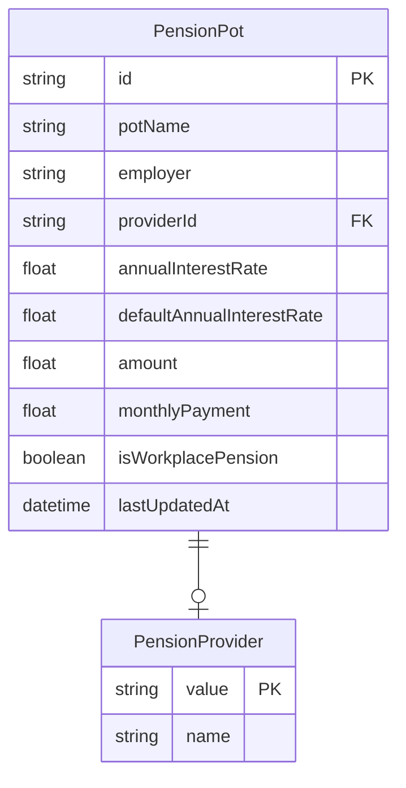

```mermaid
erDiagram
  PensionPot {
    string id PK
    string potName
    string employer
    string providerId FK
    float annualInterestRate
    float defaultAnnualInterestRate
    float amount
    float monthlyPayment
    boolean isWorkplacePension
    datetime lastUpdatedAt
  }

  PensionProvider {
    string value PK
    string name
  }

  PensionPot ||--o| PensionProvider : ""
```
