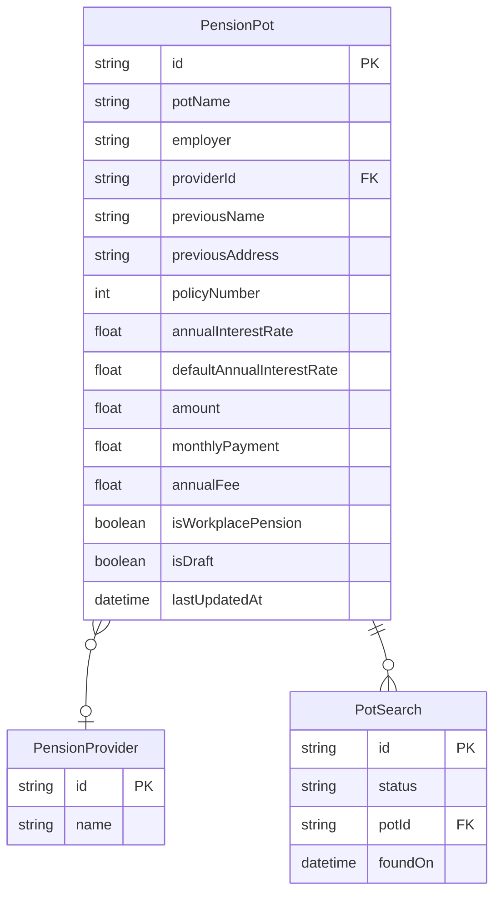

```mermaid
erDiagram
  PensionPot {
    string id PK
    string potName
    string employer
    string providerId FK
    string previousName
    string previousAddress
    int policyNumber
    float annualInterestRate
    float defaultAnnualInterestRate
    float amount
    float monthlyPayment
    float annualFee
    boolean isWorkplacePension
    boolean isDraft
    datetime lastUpdatedAt
  }

  PensionProvider {
    string id PK
    string name
  }

  PotSearch {
    string id PK
    string status
    string potId FK
    datetime foundOn
  }

  PensionPot }o--o| PensionProvider : ""
  PensionPot ||--o{ PotSearch : ""
```
